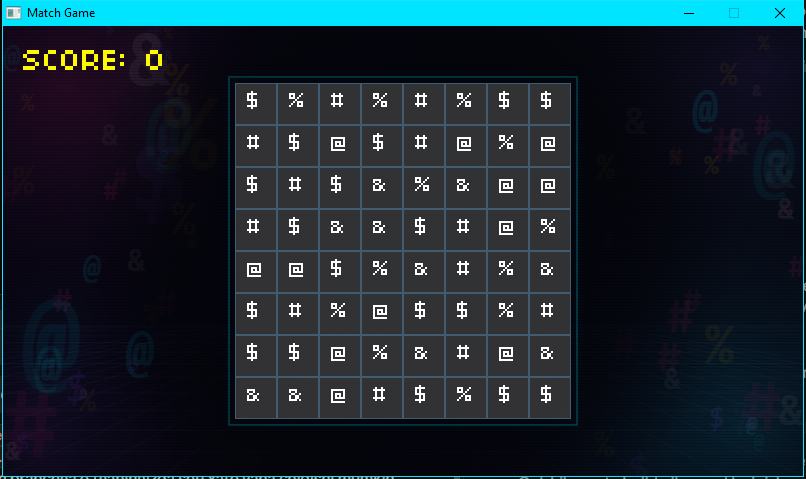

# raylib-match3

A match-3 puzzle game written in C with [raylib](https://www.raylib.com/).



## Features

- 8×8 board. Swap two neighbouring tiles; a swap that makes no match is undone.
- Horizontal and vertical matches, with cascading combos when falling tiles line up.
- Frame-rate independent falling animation.
- Score counter with a bounce effect and floating "+10" popups.
- Chiptune background music and sound effects.

## Controls

Click a tile, then click a neighbouring tile to swap them. Press `Esc` to quit.

## Building (Windows)

1. Install [MSYS2](https://www.msys2.org/) to the default location, `C:\msys64`.
2. In the **MSYS2 UCRT64** terminal, install the toolchain and raylib:
   ```bash
   pacman -S --needed mingw-w64-ucrt-x86_64-gcc mingw-w64-ucrt-x86_64-cmake mingw-w64-ucrt-x86_64-ninja mingw-w64-ucrt-x86_64-raylib
   ```
3. Build and run from the project folder:
   ```bash
   cmake --preset msys2
   cmake --build --preset msys2
   ./build/msys2/match-game.exe
   ```

In VS Code with the CMake Tools extension: select the `msys2` configure preset, build with `F7`, run with `Shift+F5`.

## Project structure

| Path | Contents |
|---|---|
| `src/main.c` | Window setup and the main loop |
| `src/game.c` | Mouse input and the game state machine |
| `src/board.c` | Board generation, match detection, gravity, swapping |
| `src/score.c` | Score, popups and the score animation |
| `src/audio.c` | Music and sound effects |
| `src/render.c` | All drawing |
| `resources/` | Background image, font and audio, copied next to the executable on build |

## Assets

- Font: [04b03](http://www.04.jp.org/) by Yuji Oshimoto, free for personal and commercial use.
- Background image, music and sound effects were generated procedurally for this project.
